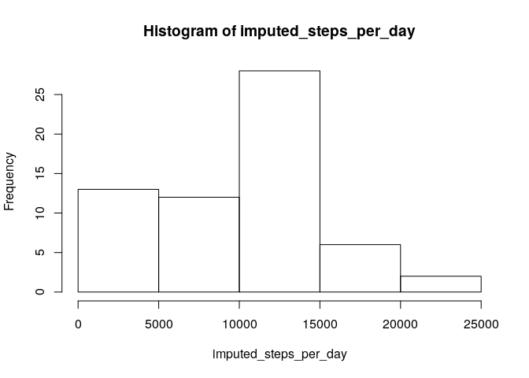
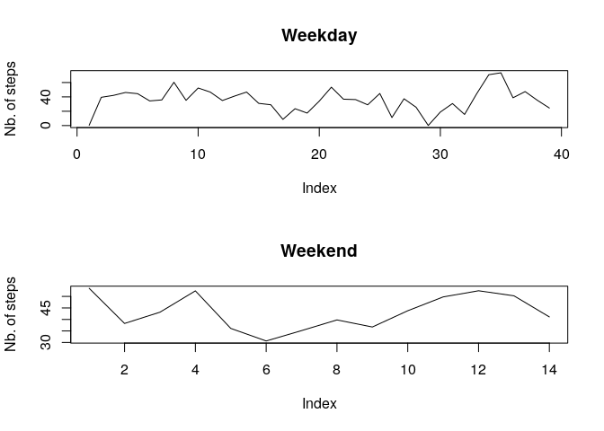

## Loading and preprocessing the data


```r
mydata <- read.csv("activity.csv")
```


## What is mean total number of steps taken per day?


```r
steps_per_day <- tapply(mydata$steps, mydata$date, sum,na.rm = T, simplify = T)
hist(steps_per_day)
```

<!-- -->

The mean number of steps taken per day is 9354.2 and the median number of steps taken ped day is 10395.


## What is the average daily activity pattern?


```r
daily_activity <- tapply(mydata$steps, mydata$interval, sum,na.rm = T, simplify = T)

plot(daily_activity, type="l")
```

<!-- -->

The 104 th interval contains on average the maximum number of steps (10927).

## Imputing missing values

The number of rows with missing values is 2304.

Imputing missing values using the daily avearge.


```r
mydata_imputed <- mydata
for (i in mydata$date)
{
  mean_steps <- round(mean(mydata$steps[mydata$date == i], na.rm = T),1)
  mydata_imputed[mydata_imputed$date == i & is.na(mydata_imputed$steps), 'steps'] <- mean_steps
  
}
```


```r
imputed_steps_per_day <- tapply(mydata_imputed$steps, mydata_imputed$date, sum,na.rm = T)
hist(imputed_steps_per_day)
```

<!-- -->

The mean number of steps taken per day is 9354.2 and the median number of steps taken ped day is 1.0395\times 10^{4}.

The mean is the same (should be) as without imputing, the median is almost the same.
The total number of steps per day should increase as the impact of imputation.


## Are there differences in activity patterns between weekdays and weekends?


```r
mydata_imputed$date <- as.Date(mydata_imputed$date)
mydata_imputed$weekdays <- as.factor(ifelse(weekdays(mydata_imputed$date) == "Saturday" | weekdays(mydata_imputed$date) == "Sunday", "weekend", "weekday"))
steps_weekday <- tapply(mydata_imputed$steps, list(mydata_imputed$weekdays, mydata_imputed$interval), mean,na.rm = T)

par(mfrow=c(2,1))
plot(na.omit(steps_weekday[1,]), type = "l", ylab="Nb. of steps", main="Weekday")
plot(na.omit(steps_weekday[2,]), type = "l", ylab="Nb. of steps", main="Weekend")
```

<!-- -->

```r
par(mfrow=c(1,1))
```

